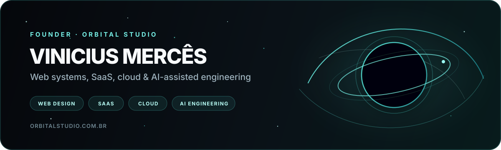
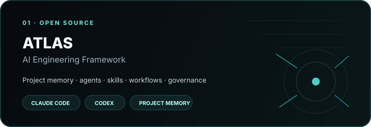
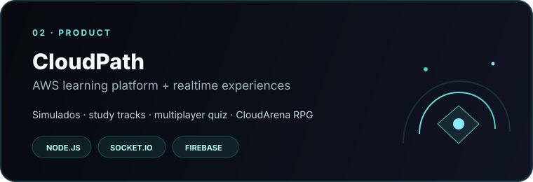
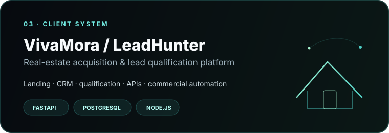

<p align="center">
  
</p>

<p align="center">
  <a href="https://orbitalstudio.com.br">
    
  </a>
  <a href="https://www.linkedin.com/in/vinicius-merces-aws-dev/">
    
  </a>
  <a href="mailto:vmerces24@gmail.com">
    
  </a>
</p>

<p align="center">
  
</p>

<p align="center">
  
</p>

---

<table>
<tr>
<td width="33%" valign="top">

### ◉ Orbital Studio

Criação de **sites, landing pages, sistemas e SaaS** com foco em experiência, performance, conversão e identidade.

[**orbitalstudio.com.br →**](https://orbitalstudio.com.br)

</td>
<td width="33%" valign="top">

### ◈ Produtos & Sistemas

Projetos próprios e comerciais envolvendo **APIs, CRMs, automações, realtime, bancos de dados e plataformas web**.

**ATLAS · CloudPath · LeadHunter**

</td>
<td width="33%" valign="top">

### ◇ Cloud & Infra

**AWS Certified Cloud Practitioner**, AWS re/Start Graduate, Linux, redes, troubleshooting e arquitetura cloud em evolução contínua.

**AWS · Linux · PostgreSQL**

</td>
</tr>
</table>

---

## ◉ Orbital Studio

> **Desenvolvimento digital sob medida para empresas que querem ir além de simplesmente “ter um site”.**

A **[Orbital Studio](https://orbitalstudio.com.br)** é o meu estúdio de desenvolvimento. Trabalho da estratégia e experiência visual até a implementação técnica, integrações e estrutura necessária para que o produto continue evoluindo depois do lançamento.

<p align="center">
  
  
  
  
  
  
</p>

O próprio site da Orbital é parte do portfólio técnico: **Next.js, React, TypeScript, Tailwind CSS, GSAP e Three.js**, conteúdo PT-BR/EN, SEO técnico, acessibilidade, testes automatizados e experiências visuais orientadas por scroll.

<p align="center">
  <a href="https://orbitalstudio.com.br">
    
  </a>
</p>

---

## ◈ Selected Work

<p align="center">
  <a href="https://github.com/Vinicius-Merces/atlas">
    
  </a>
  <a href="https://github.com/Vinicius-Merces/kink-is-not-kahoot">
    
  </a>
</p>

<p align="center">
  <a href="https://vivamoraimob.com.br">
    
  </a>
</p>

### ATLAS AI Engineering Framework

Framework open source **repository-native** para desenvolvimento assistido por IA. Mantém memória de projeto, agentes, skills, workflows, contratos, validações e continuidade entre sessões. **Claude Code** é o runtime canônico e **Codex** possui suporte de compatibilidade.

`AI Engineering` · `Project Memory` · `Agents` · `Workflows` · `Claude Code` · `Codex`

### CloudPath

Plataforma educacional para certificações AWS que reúne **simulados, trilhas de estudo, quiz multiplayer em tempo real e CloudArena**, um RPG educacional construído sobre o mesmo banco de conteúdo.

`Node.js` · `Socket.IO` · `Firebase` · `Python` · `GitHub Actions` · `Azure Speech`

[**Abrir aplicação →**](https://cloudpath.squareweb.app)

### VivaMora / LeadHunter

Projeto comercial para o mercado imobiliário combinando uma landing premium com **captação e qualificação de leads, CRM, APIs e automação comercial**, apoiado por serviços independentes de backend.

`FastAPI` · `PostgreSQL` · `Node.js` · `APIs` · `CRM` · `Lead Generation`

[**Abrir VivaMora →**](https://vivamoraimob.com.br)

---

## ✦ Tech Constellation

<p align="center">
  
</p>
<p align="center">
  
</p>

<table>
<tr>
<td width="50%" valign="top">

**Interface & Experience**

Next.js · React · TypeScript · JavaScript · Tailwind CSS · Three.js · React Three Fiber · GSAP · responsive design · accessibility

</td>
<td width="50%" valign="top">

**Backend & Data**

Node.js · Express · Python · FastAPI · Socket.IO · PostgreSQL · Supabase · Firebase · Firestore · SQL

</td>
</tr>
<tr>
<td width="50%" valign="top">

**Cloud & Infrastructure**

AWS · Linux · redes · Square Cloud · Vercel · GitHub · troubleshooting

</td>
<td width="50%" valign="top">

**Quality & AI Engineering**

Vitest · Playwright · Testing Library · axe-core · GitHub Actions · Claude Code · Codex · ATLAS · Obsidian project memory

</td>
</tr>
</table>

---

## ◇ Da infraestrutura ao produto

Sou graduado em **Análise e Desenvolvimento de Sistemas** e tenho mais de **8 anos de experiência como Especialista em Produtos e Instrutor Técnico**, atuando com diagnóstico, suporte, treinamento e relacionamento técnico em soluções Canon, Brother, Konica Minolta, Epson e Kyocera.

Essa trajetória moldou a forma como desenvolvo software hoje: começo entendendo o problema, questiono o que realmente precisa existir e procuro entregar algo que seja **claro para o usuário, sustentável tecnicamente e útil para o negócio**.

Atualmente concentro minha atuação em três frentes que se complementam:

- desenvolvimento de **sites, sistemas web e SaaS**;
- **cloud, Linux, redes e infraestrutura**;
- engenharia de software assistida por IA com **contexto persistente, agentes especializados e validação**.

---

## ☁ Cloud Track

<p align="center">
  
  &nbsp;&nbsp;&nbsp;
  
</p>

<p align="center">
  <strong>AWS Certified Cloud Practitioner (CLF-C02)</strong><br/>
  <strong>AWS re/Start Graduate</strong><br/>
  <strong>Graduação em Análise e Desenvolvimento de Sistemas</strong>
</p>

Continuo aprofundando conhecimentos em **arquiteturas AWS, Linux, redes, segurança, dados e troubleshooting** por meio de estudo e laboratórios práticos. Mantenho uma separação clara entre aprendizado aplicado e experiência profissional em cloud.

---

## ⌁ Engineering with AI

Não uso IA apenas como autocomplete. Nos projetos mais recentes venho estruturando um fluxo de engenharia em que **decisões, contexto, validações e continuidade vivem junto do código**.

```text
context → plan → specialist agents → implementation → validation → project memory
```

Esse processo levou à criação do **[ATLAS](https://github.com/Vinicius-Merces/atlas)**, um framework para preservar conhecimento do projeto e coordenar Claude Code, Codex, agentes, skills, workflows e revisões de forma rastreável.

---

## ⌘ GitHub Activity

<p align="center">
  
</p>

---

<h2 align="center">Vamos colocar uma boa ideia em órbita?</h2>

<p align="center">
  Para sites, landing pages, SaaS, sistemas web e soluções digitais sob medida.<br/>
  <strong>Orbital Studio</strong>
</p>

<p align="center">
  <a href="https://orbitalstudio.com.br">
    
  </a>
  <a href="https://www.linkedin.com/in/vinicius-merces-aws-dev/">
    
  </a>
</p>

<p align="center">
  <sub>Web Development · SaaS · Cloud & Infrastructure · AI-assisted Engineering</sub>
</p>
